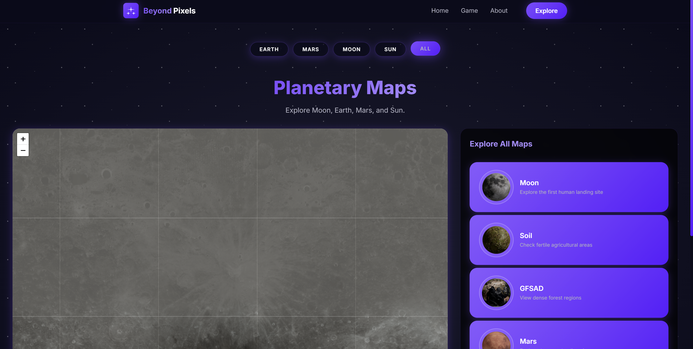
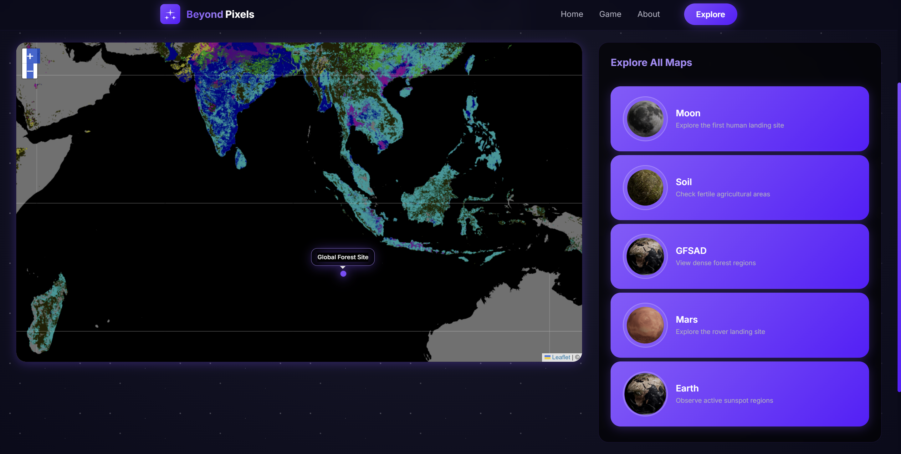
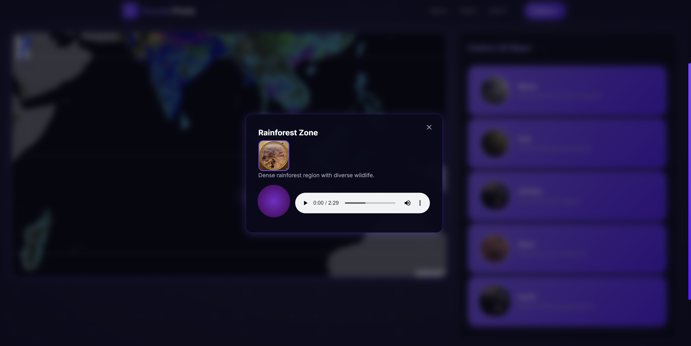

<h1 align="center">
  <br>
  Embiggen Your Eyes
  <br>
</h1>

<h4 align="center">An interactive astronomy platform built for the NASA Space Apps Challenge 2025, making astronomical imagery more accessible and engaging.
</h4>

<div align="center">
</div>

<p align="center">
  <a href="#live-demo">Live Demo</a> •
  <a href="#features">Features</a> •
  <a href="#how-to-use-locally">How To Use Locally</a> •
  <a href="#technology">Technology</a> •
  <a href="#credits">Credits</a> •
  <a href="#license">License</a>
</p>


<br>
<br>

<br>
<br>


## Live Demo

Check out the live version of **Embiggen Your Eyes** and start exploring space imagery instantly:

[🌐 Visit Live Demo](https://beyond-pixels.netlify.app/)

---

## Features

* **High-Performance Image Viewer**

  * Explore deep zoom imagery of celestial objects.
* **Annotation Tools**

  * Mark and describe features on astronomical images.
* **Educational Content**

  * Learn about space phenomena alongside the images.
* **Zoom and Drag**

  * Navigate imagery smoothly with intuitive gestures.
* **Interactive UI**

  * Built with animations and responsive design for accessibility.

---

## How To Use Locally

To clone and run this application, you'll need [Git](https://git-scm.com) and [Node.js](https://nodejs.org/en/download/) installed. From your terminal:

```bash
# Clone this repository
$ git clone https://github.com/georgeibrahim1/beyond-pixels-frontend

# Go into the repository
$ cd beyond-pixels-frontend

# Install dependencies
$ npm install

# Run the app
$ npm start
```

---

## Technology

* **React** (UI framework)
* **Leaflet** (map & imagery navigation)
* **NASA APIs** (imagery + data)
* **GDAL** (Geospatial Data Abstraction Library)
* **Flask API** (Lightweight backend service for serving tiles, handling data requests, and enabling future API extensions)


---

## Credits

This software uses the following open-source projects:

* [React](https://reactjs.org/)
* [Leaflet](https://leafletjs.com/)
* [NASA Open APIs](https://api.nasa.gov/)

> This project uses NASA’s open data but is **not endorsed or certified by NASA**.

---

## License

MIT
